# azd-dev-prod-appservice-storage

Simple web application (Azure App Service and Azure Storage) with 2 different infrastructure configurations for dev and prod. 

Reference: https://learn.microsoft.com/azure/app-service/tutorial-networking-isolate-vnet

## Development Environment (`infra/`)

```mermaid
graph TB
    subgraph "Azure Subscription"
        subgraph "Resource Group"
            subgraph "Monitoring"
                LAW["📊 Log Analytics Workspace"]
                AI["📈 Application Insights"]
                DASH["📋 Dashboard"]
            end
            
            subgraph "Compute"
                ASP["🖥️ App Service Plan<br/>SKU: B2 (Linux)"]
                AS["🌐 App Service<br/>Python 3.13"]
            end
            
            subgraph "Storage"
                SA["💾 Storage Account<br/>Public Access: Enabled<br/>Container: files"]
            end
            
            subgraph "Identity"
                MI["🔑 Managed Identity"]
            end
        end
    end
    
    subgraph "External"
        USER["👤 User/Developer"]
        INTERNET["🌍 Internet"]
    end
    
    %% Relationships
    AS --> ASP
    AS -.-> AI
    AI --> LAW
    AS --> MI
    MI --> SA
    USER --> AS
    USER --> SA
    AS <--> SA
    
    %% Styling
    classDef compute fill:#b3e5fc,stroke:#01579b,stroke-width:2px,color:#000000
    classDef storage fill:#e1bee7,stroke:#4a148c,stroke-width:2px,color:#000000
    classDef monitor fill:#c8e6c9,stroke:#1b5e20,stroke-width:2px,color:#000000
    classDef identity fill:#ffcc80,stroke:#e65100,stroke-width:2px,color:#000000
    classDef external fill:#ffcdd2,stroke:#c62828,stroke-width:2px,color:#000000
    
    class ASP,AS compute
    class SA storage
    class LAW,AI,DASH monitor
    class MI identity
    class USER,INTERNET external
```

### Development Environment Features:
- **Public Storage Access**: Storage account accessible from the internet
- **Simple Networking**: Direct access to all resources
- **Basic Security**: Managed identity for service-to-service authentication
- **Cost Optimized**: B2 App Service Plan suitable for development workloads

## Production Environment (`infra-prod/`)

```mermaid
graph TB
    subgraph "Azure Subscription"
        subgraph "Resource Group"
            subgraph "Virtual Network"
                subgraph "VNet Integration Subnet<br/>10.0.0.0/24"
                    VNET_INT["🔗 VNet Integration<br/>Delegated to App Service"]
                end
                
                subgraph "Private Endpoint Subnet<br/>10.0.1.0/24"
                    PE["🔒 Private Endpoint"]
                end
            end
            
            subgraph "Private DNS"
                PDNS["🌐 Private DNS Zone<br/>privatelink.blob.core.windows.net"]
                PDNS_GROUP["🔗 DNS Zone Group"]
            end
            
            subgraph "Monitoring"
                LAW["📊 Log Analytics Workspace"]
                AI["📈 Application Insights"]
                DASH["📋 Dashboard"]
            end
            
            subgraph "Compute"
                ASP["🖥️ App Service Plan<br/>SKU: S1 (Linux)"]
                AS["🌐 App Service<br/>Python 3.13<br/>VNet Integrated"]
            end
            
            subgraph "Storage"
                SA["💾 Storage Account<br/>Public Access: DISABLED<br/>Container: files"]
            end
            
            subgraph "Identity"
                MI["🔑 Managed Identity"]
            end
        end
    end
    
    subgraph "External"
        USER["👤 Users"]
        INTERNET["🌍 Internet"]
    end
    
    %% Relationships
    AS --> ASP
    AS --> VNET_INT
    AS -.-> AI
    AI --> LAW
    AS --> MI
    MI --> SA
    PE --> SA
    VNET_INT -.-> PE
    PE --> PDNS_GROUP
    PDNS_GROUP --> PDNS
    PDNS -.-> VNET_INT
    USER --> AS
    AS --> PE
    PE --> SA
    
    %% Styling
    classDef compute fill:#b3e5fc,stroke:#01579b,stroke-width:2px,color:#000000
    classDef storage fill:#e1bee7,stroke:#4a148c,stroke-width:2px,color:#000000
    classDef monitor fill:#c8e6c9,stroke:#1b5e20,stroke-width:2px,color:#000000
    classDef identity fill:#ffcc80,stroke:#e65100,stroke-width:2px,color:#000000
    classDef network fill:#dcedc8,stroke:#33691e,stroke-width:2px,color:#000000
    classDef external fill:#ffcdd2,stroke:#c62828,stroke-width:2px,color:#000000
    classDef security fill:#f8bbd9,stroke:#880e4f,stroke-width:2px,color:#000000
    
    class ASP,AS compute
    class SA storage
    class LAW,AI,DASH monitor
    class MI identity
    class VNET_INT,PE,PDNS,PDNS_GROUP network
    class USER,INTERNET external
```

### Production Environment Features:
- **Private Networking**: Virtual network with dedicated subnets
- **VNet Integration**: App Service integrated with virtual network
- **Private Endpoints**: Storage accessible only through private network
- **Private DNS**: Custom DNS resolution for private endpoints
- **Zero Public Access**: Storage account completely isolated from internet
- **Enhanced Security**: All traffic flows through private network
- **Production Scale**: S1 App Service Plan for production workloads

## Key Differences

| Feature | Development | Production |
|---------|-------------|------------|
| **Storage Access** | Public (internet accessible) | Private (VNet only) |
| **Networking** | Standard public endpoints | Private endpoints + VNet integration |
| **DNS Resolution** | Public DNS | Private DNS zones |
| **App Service Plan** | B2 | S1 |
| **Log Analytics** | Public access from all networks | Public access from all networks (network isolation not implemented yet) |
| **Application Insights** | Public access from all networks | Public access from all networks (network isolation not implemented yet) |
